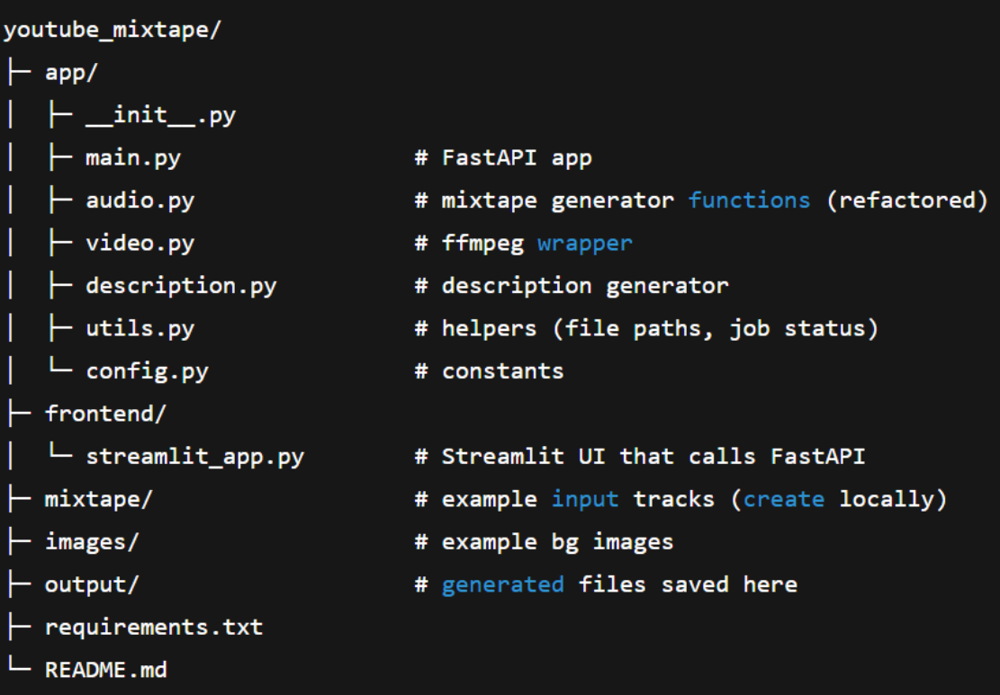

# 🎧 YouTube Mixtape Automation (FastAPI + Streamlit)

This project converts a simple Jupyter-notebook workflow into a **modular**, **API-driven**, and **UI-based** application for creating YouTube-ready mixtapes.

It allows you to:

✔ Upload multiple songs  
✔ Auto-generate smooth fade-in/fade-out **DJ-style mixtapes**  
✔ Auto-generate **YouTube descriptions** with timestamps  
✔ Combine audio + background image to create **MP4 videos** using FFmpeg  
✔ Use a simple **Streamlit UI**  
✔ Handle background jobs with FastAPI

---

## 🚀 Features

### 🎶 1. Mixtape Generator
- Concatenate multiple songs
- Add smooth transitions between tracks
- Auto-normalize audio channels & frame rate
- Outputs a final `mixtape.mp3`

### 📝 2. YouTube Description Generator
- Reads track durations
- Creates timestamped tracklist
- Adds hashtags & metadata

### 🎥 3. Video Renderer (FFmpeg)
- Converts a static image + MP3 into an MP4 video
- Optimized for long audio files
- Uses `libx264` + AAC audio codec

### 🖥 4. Streamlit Frontend
A simple web UI to:
- Upload audio files
- Run mixtape creation
- Generate descriptions
- Render video
- Download results

### 🛠 5. FastAPI Backend
API endpoints for:
- File upload  
- Mixtape creation (background job)  
- Description generation  
- Video rendering  
- Job status polling  

---

---

## 🧩 How it Works (Pipeline)

1. **Upload tracks**  
   Streamlit uploads → FastAPI saves to `/uploaded/{job_prefix}/`.

2. **Create mixtape**  
   FastAPI background job → `audio.py` → applies fade transitions → saves `output/mixtape.mp3`.

3. **Generate description**  
   Reads each audio file → calculates timestamps → returns formatted description.

4. **Create video**  
   `video.py` runs FFmpeg → merges background image + MP3 → outputs `output/mixtape_vid.mp4`.

5. **Download**  
   Streamlit shows links to download final files.

---

UI available at:  
👉 http://localhost:8501

---

## 🛠 API Endpoints Summary

| Endpoint | Method | Description |
|---------|--------|-------------|
| `/upload-track/` | POST | Upload a single audio file |
| `/create-mixtape/` | POST | Start background mixtape job |
| `/job/{job_id}` | GET | Check job status |
| `/generate-description/` | POST | Generate YouTube description |
| `/make-video/` | POST | Combine image + audio → MP4 |
| `/download/` | GET | Download output files |

---

## 📝 Notes & Improvements

- Current job store is **in-memory** → wiped on restart  
- Consider using Redis/SQLite for persistence  
- Audio loudness normalization can be added (LUFS)  
- You may add authentication for local privacy  
- Supports MP3, WAV, FLAC, OGG, AAC, M4A

---

## ❤️ Credits

Created as a modular end-to-end automation project  
using **Python, FastAPI, Streamlit, FFmpeg, Pydub**.

